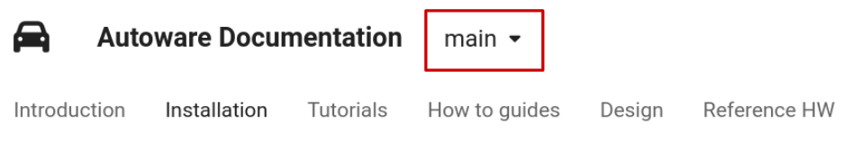
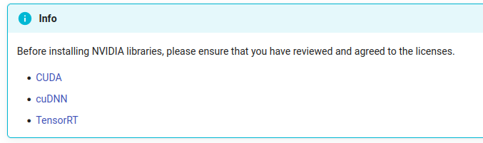
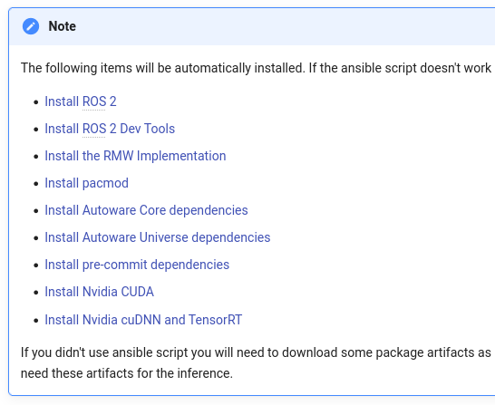

# Build Autoware

## Source Code and Dependency Preparation

Follow the instructions on this
[page](https://autowarefoundation.github.io/autoware-documentation/main/installation/autoware/source-installation/)
to build Autoware source code.

Switch to specific branch depending on your **OS** and **ROS2**
version.




Clone the Autoware Repo.

```bash
git clone https://github.com/autowarefoundation/autoware.git
cd autoware
```

There are two ways to install dependent libraries. Either (1) run the
official Ansible script or (2) install the them manually.

The Ansible script is only recommended for freshly installed Ubuntu
systems. It will interfere with existing CUDA. If you have custom CUDA
installation, such as JetPack, it's recommended to go on the manual way.

Install dependent packages. You may skip “Install ROS 2“ if you already
have ROS 2 installed. The “Install Nvidia CUDA/cuDNN/TensorRT“ should be
skipped if they are already configured on the system.




## Compile the Autoware Project

The Autoware repo layout itself follows ROS convention. All packages
reside in the `src` directory.

### The vcs-rosdep-colcon Chain

The vcs → rosdep → colcon chain is a common practice to build most ROS
projects, including Autoware.

- Run `vcs` to download dependent repositories into the `src` folder.

  ```bash
  cd autoware
  mkdir src
  vcs import src < autoware.repos
  ```

- Run `rosdep` to install system dependencies. It scans through
  packages within `src` and runs `apt install xxx` according to their
  dependency requirements.

  ```bash
  source /opt/ros/humble/setup.bash
  rosdep install -y --from-paths src --ignore-src --rosdistro $ROS_DISTRO
  ```

- Build the whole Autoware project using `colcon`. It scans through
  packages in `src` and compile them according to their dependency
  order.

  ```bash
  colcon build --symlink-install --cmake-args -DCMAKE_BUILD_TYPE=Release
  ```

### Compilation Result

`colcon` produces the followings directories serving respective
purposes.

- `install` places final products of the build, storing compiled
  program binaries and libraries.
- `build` stores the intermediate files for the build.
- `log` saves the compilation log.

The `--symlink-install` option creates symbolic links to source files
in the installation. It makes life easier in the case that Python
scripts and configuration files are modified frequently.


## Troubleshooting

### Missing Dependencies

In many cases, compilation error is due to missing dependencies. Run
`rosdep` to make sure required system dependencies available before
compilation.

```bash
rosdep update --rosdistro $ROS_DISTRO
```

### Disable Warning-as-errors

Autoware enforces strict auditing rules by default. Remove the
**-Werror** option to lift the restriction. Open autoware\_package.cmake
and modify it as follows.7

```diff
- add_compile_options(-Wall -Wextra -Wpedantic -Werror)
+ add_compile_options(-Wall -Wextra -Wpedantic)
```

### Compile Error on trtexec\_vender

Facing problem when building **trtexec_vender.** Modify
src/universe/autoware.universe/common/trtexec_vendor/CMakeLists.txt.

```diff
- GIT_TAG ${TENSORRT_VERSION}
+ GIT_TAG v${TENSORRT_VERSION}
```

### Restrict Parallel Colcon Workers

Colcon build failed because too many packages were building in parallel.
(Exceeding the hardware load limit.) Adding parameter
“**--parallel-workers**“ when executing **colcon build**.

```bash
colcon build \
    --symlink-install \
    --cmake-args -DCMAKE_BUILD_TYPE=Release \
    --parallel-workers 1
```

TODO(Roger)

## Using Autoware RViz

TODO(Roger)
