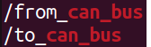
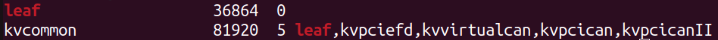
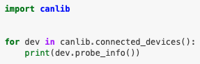

## Control

The controller module is one of the most diverse part in Autoware.
That's because the controlling mechanism is vehicle-specific.
Petrol-driven cars have pedals. Electric cars adopts electronic
stability controller (ESC). Small battery-driven cars use PWM
controller. Hence, there is no common interface for low-level control.

Autoware does not assume the controlling mechanism, but sends commands
in `autoware_auto_control_msgs/AckermannControlCommand` type, which
include the target speed and target acceleration, etc. A vehicle driver
node must be implemented to convert these commands to low-level
controlling commands.

Autoware defaults to the PACMod protocol over CANbus to send commands.
Unfortunately, it is available only on a handful of vehicles
([link](https://autonomoustuff.atlassian.net/wiki/spaces/PACMod/pages/1510604805/Vehicle+Platform+PACMod+Compatibility)).
There are chances that you write your vehicle driver.

## Example: ARTC CANbus

To communicate with CAN bus network, we mainly have two ways:
Firstly, use the `ros2_socketcan` ROS package which provided by AWF.
It creates two topics: `from_can_bus` and `to_can_bus`, the former is
a topic to be subscribed to read CAN bus frame from the CAN bus
network and the latter is a topic to be published to write CAN bus
frame to CAN bus network. Note that you have to plugin your Kvaser
adapter before running the socketcan ROS package, and wake up your
Kvaser adapter by running the command:

```bash
sudo modprobe can  
sudo modprobe can_raw  
sudo ip link set can0 type can bitrate 5000000  
sudo ip link set up can0
```

The bitrate can be changed if needed.



In order to use `ros2_socketcan` ROS package, we cannot preinstall
Leaf driver which vendored by Kvaser. Type `lsmod \| grep leaf` to
verify the installation of the Leaf driver, if you see the below
output message, then the system has installed Leaf driver.



Secondly, use the Kvaser driver and corresponding APIs to
communicate with the CAN bus network. Visit this
 [link](https://www.kvaser.com/canlib-webhelp/section_install_windows.html)
if you're using Windows. However, visit this
[link](https://www.kvaser.com/canlib-webhelp/section_install_linux.html)
if you're running Linux. Next, choose the proper SDK and Kvaser
driver. After that, install the corresponding CANlib to control the
installed CAN driver. Take python as an example, run `pip install
canlib` to install python wrapper for Kvaser CANlib. After
installation, you can run below sample python script to verify all
installation are working. If CANlib and driver working, your Kvaser
adapter information should be printed out.



Note that you have to plugin your Kvaser adapter before running the
python script.

Every vehicle has its own specific CAN bus communication
protocol. Thus, in order to use CAN bus communication to operate the
vehicle, you must have the appropriate CAN message map in order to
send the proper CAN bus control command to the CAN bus network. The
PID controller assists in achieving smooth throttle and brake control,
which is necessary to replicate human driving behavior. If you are
using python for development the control logic, you can install
simple-pid package using `pip install simple-pid` command to use the
PID controller. To leverage PID controller, your vehicle needs to be
able to retrieve the vehicle's current state, e.g., current speed of
the vehicle, current acceleration of vehicle, current steering angle
of vehicle, etc. You can set your setpoint(SP) and calculate the next
step value with the current status of vehicle. After a while, the
vehicle status will approach to the SP smoothly. Note that PID
controllers need to be tuned for individual type of vehicle.

TODO(ykming)

SocketCAN, kvaser, PID controller

## Example: F1EIGTH ESC Controller

A script is provided by the manufacturer for controlling F1EIGTH car
using a terminal interface. It utilized Adafruit's PCA9685 library to
manage the steering servo and the Electronic Speed Controller
(ESC). The user can control acceleration, braking, and steering via
keyboard inputs. The code also includes an interface for displaying
speed and steering angle updates and features for initiating and
terminating the program.

The code primarily revolves around the concept of Pulse Width
Modulation (PWM), which is crucial for controlling the speed of motors
and the position of servos in remote-controlled cars. The Adafruit
PCA9685 library used in the script allows for precise control over PWM
signals.  This is essential for adjusting the speed of the car's motor
(through the ESC) and the angles of the steering servo. The
`pwm.set_pwm_freq()` function sets the frequency of the PWM signal,
and `pwm.set_pwn()` is used to specify the channel, on-time, and
off-time of the PWM signal, directly influencing motor speed and servo
position. This integration of software and hardware illustrates the
advanced control capabilities provided for remote-controlled vehicles.
