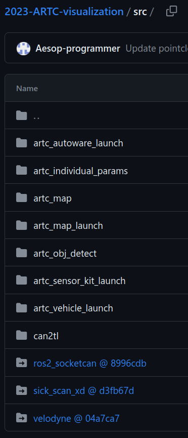

# Customization

The customization process starts by a new repository along side
Autoware. We did not modify the Autoware source repo because it creates
hard forks. Instead, the project-specific packages, launch files and
configuration files are placed in the new repo. We will play the
**source combo** trick to append our packages to existing compiled
Autoware.

## The Source Combo Trick

## Project Layout & Version Control

TODO(Jerry)

