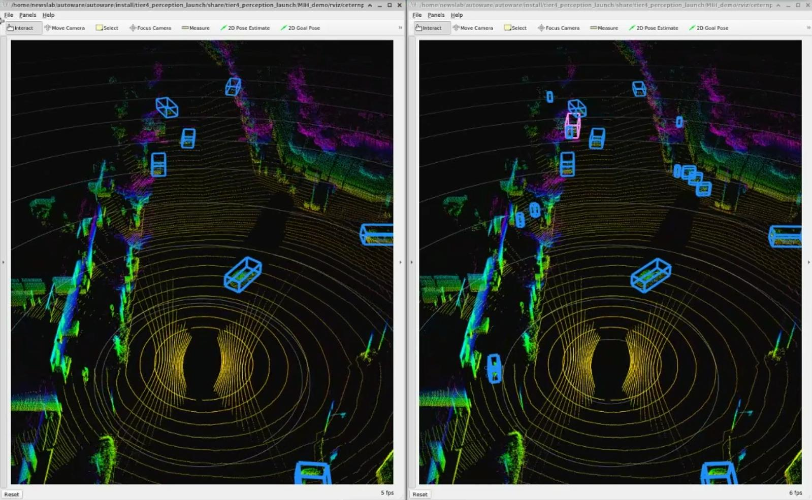
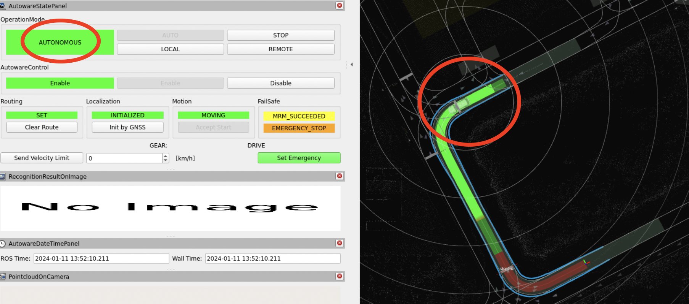
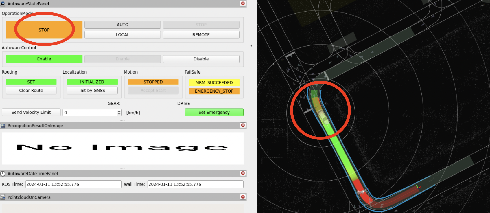

# Perception

## Example: lidar_centerpoint

TODO(allan&簡, 仴筑): the usage of model files. The CUDA env setup.
Testing procedure.

Newslab note: [Launch lidar-centerpoint demo
document](https://newslabn.csie.ntu.edu.tw:3000/en/wayside-team/notes/2022-09-22_run-autoware-lidar_centerpoint)

GitHub :
[centerpoint\_vs\_centerpoint-tiny](https://github.com/autowarefoundation/autoware.universe/tree/main/perception/lidar_centerpoint/launch/centerpoint_vs_centerpoint-tiny)



`centerpoint\_vs\_centerpoint` visualizer

- Download and compile model files
  - Create a folder named `~/autoware_data/lidar_centerpoint`, where
    contains four model files.
    - [pts\_voxel\_encoder\_centerpoint.onnx](https://awf.ml.dev.web.auto/perception/models/centerpoint/v2/pts_voxel_encoder_centerpoint.onnx)
    - [pts\_backbone\_neck\_head\_centerpoint.onnx](https://awf.ml.dev.web.auto/perception/models/centerpoint/v2/pts_backbone_neck_head_centerpoint.onnx)
    - [pts\_voxel\_encoder\_centerpoint.onnx](https://awf.ml.dev.web.auto/perception/models/centerpoint/v2/pts_voxel_encoder_centerpoint_tiny.onnx)
    - [pts\_backbone\_neck\_head\_centerpoint.onnx](https://awf.ml.dev.web.auto/perception/models/centerpoint/v2/pts_backbone_neck_head_centerpoint_tiny.onnx)
  - When first running lidar\_centerpoint package, it will automatically
    compile and produce engine file. The engine file is related to CUDA
    version. As a result, if you want to run lidar\_centerpoint on a
    different computer where CUDA version is different from the previous
    one, you need to delete the engine file and recompile.
- Testing procedure
  - `$HOME/2023-08-09_rsu-to-car-lidar-fusion-rosbag/rosbag2_2023_08_09-13_33_22`
    can be change to other rosbag record for testing.
  - The output detection will be sent to `/objects` topic, you may use
    `ros2 topic echo` command to check whether the package works.


```bash
source ~/autoware/install/setup.bash
ros2 bag play -l \
    $HOME/2023-08-09_rsu-to-car-lidar-fusion-rosbag/rosbag2_2023_08_09-13_33_22 \
    --remap /velodyne_points:=/sensing/lidar/pointcloud
ros2 run tf2_ros static_transform_publisher 0 0 0 0 0 0 base_link velodyne
ros2 launch lidar_centerpoint lidar_centerpoint.launch.xml
```

## Example: QBOX Driver

TODO:(許)

The QBOX driver is a ROS node designed for reading Ethernet messages
from QBOX. It publishes these messages into various ROS topics and can
automatically stop the Autoware ego vehicle by invoking the
`/api/operation_mode/change_to_stop` service in Autoware if it detects
a high collision risk, as indicated by a low time-to-collision (TTC)
value.

- Clone the
  [Repo](https://github.com/NEWSLabNTU/2023-nycu-project/tree/main/src/qbox),
  ensure the project is built following the tutorial.

- Run the QBOX node using the following command.

```bash
source ~/autoware/install/setup.bash
source install/setup.bash
ros2 run qbox qbox
```

To specify custom values for `ip`, `port`, or `ttc`, use the
following format:

```bash
source ~/autoware/install/setup.bash
source install/setup.bash
ros2 run qbox qbox --ros-args -p ip:=<your_ip> -p port:=<your_port> -p ttc:=<your_ttc>
```

For example:

```bash
ros2 run qbox qbox --ros-args -p ip:=10.0.0.2 -p port:=9998 -p ttc:=5
```

- Testing if ego vehicle stop when it detects a high collision risk.
  - Follow the tutorial in [Planning
    simulation](https://autowarefoundation.github.io/autoware-documentation/main/tutorials/ad-hoc-simulation/planning-simulation/#planning-simulation)
    to launch the simulator.
  - Start the ego vehicle in AUTONOMOUS mode.
  - Observe if the ego vehicle stop due to low TTC values or check if
    OperationMode in AutowareStatePanel change from AUTONOMOUS to
    STOP.
    - AUTONOMOUS

  

- STOP

  

- Check if ROS topic publish correctly

  Run the node and test the following data topics in separate shells:

- FCW Data: Observe `message` and `TTC.value` for collision risk
  assessment.

  ```bash
  ros2 topic echo /perception/fcw_TTC
  ```

- LDW Data: Monitor `message` and `LD_happened_code.value` for lane
  departure alerts.

  ```bash
  ros2 topic echo /perception/ldw_lane_departure
  ```
