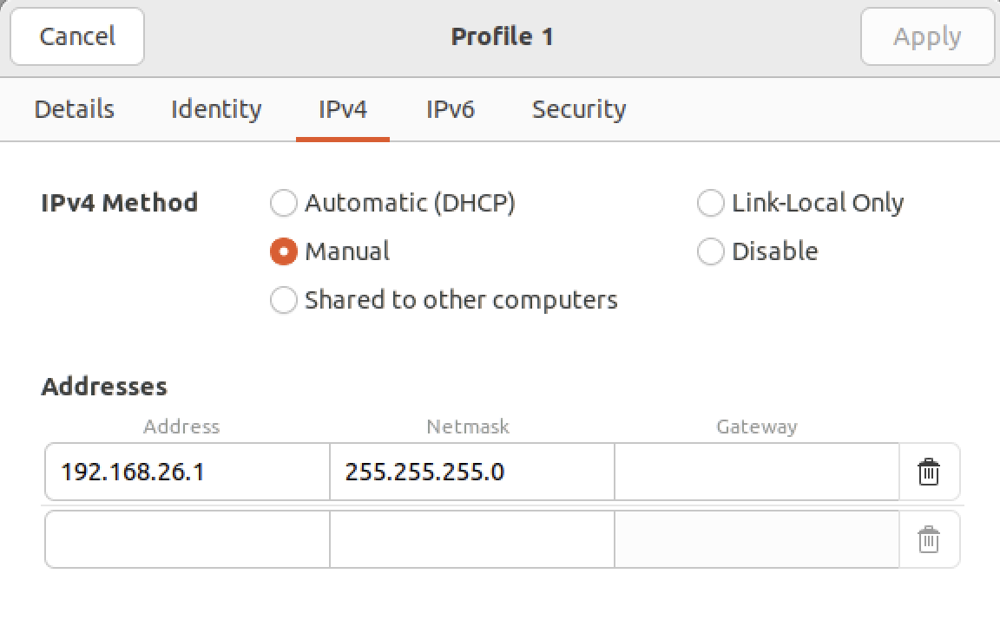
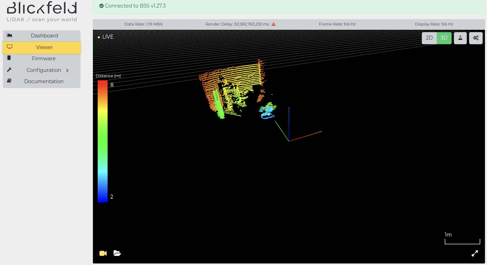

# Blickfield Cube1

TODO(許)

The BLS driver.

- Connect with Blickfeld Cube1.
  - Add a wired interface with the IP address 192.168.26.1/24
  
- The displayed technology is only supported by the Chrome browser. Use
  Chrome to check if the webpage correctly displays the point cloud.
  
- Install blickfeld-scanner-library (BSL). Please check the official
  [installation
  document](https://docs.blickfeld.com/cube/latest/external/blickfeld-scanner-lib/install.html).

```bash
# download
sudo apt install libprotobuf-dev libprotobuf23 protobuf-compiler
git clone https://github.com/Blickfeld/blickfeld-scanner-lib.git
cd blickfeld-scanner-lib
git checkout v2.20.6
git submodule update --init --recursive

# build
cmake -B build -S .
cmake --build build --parallel
sudo cmake --install build
```

- Build blickfeld cube 1 ROS2 package

[Blickfeld ROS2 package official
document](https://docs.blickfeld.com/cube/latest/external/ros/driver-v2/README.html)

- Download Cube 1 ROS 2 Driver from
  [https://www.blickfeld.com/resources/](https://www.blickfeld.com/resources/)

- Install dependencies

```bash
sudo apt install ros-${ROS_DISTRO}-diagnostic-updater
sudo apt install ros-${ROS_DISTRO}-diagnostic-msgs
```

- Source ROS2 and create colcon workspace

```bash
source /opt/ros/${ROS_DISTRO}/setup.bash
mkdir -p ~/blickfeld/src
```

- Move the `ros2_blickfeld_driver` package into `blickfeld/src`
- Modify `blickfeld/src/ros2_blickfeld_driver_src-v1.5.5/CMakeLists.txt`
  - Change C++ standard from 14 to 17

```diff
- set(CMAKE_CXX_STANDARD 14)
+ set(CMAKE_CXX_STANDARD 17)
```

- Update Blickfeld scanner package version from 2.18.2 to 2.20.6

```diff
- find_package(blickfeld-scanner 2.18.2 REQUIRED full)
+ find_package(blickfeld-scanner 2.20.6 REQUIRED full)
```

- Add include directories for ROS Humble

```diff
+ include_directories(/opt/ros/humble/include/tf2_geometry_msgs)
+ include_directories(/opt/ros/humble/include/tf2)
+ include_directories(/opt/ros/humble/include/tf2_ros)
+ include_directories(/opt/ros/humble/include/cv_bridge)
+ include_directories(/opt/ros/humble/include/rclcpp)
+ include_directories(/opt/ros/humble/include/rcl)
+ include_directories(/opt/ros/humble/include/rcl_yaml_param_parser)
+ include_directories(/opt/ros/humble/include/rcpputils)
+ include_directories(/opt/ros/humble/include/tracetools)
+ include_directories(/opt/ros/humble/include/rcl_interfaces)
+ include_directories(/opt/ros/humble/include/libstatistics_collector)
+ include_directories(/opt/ros/humble/include/statistics_msgs)
+ include_directories(/opt/ros/humble/include/diagnostic_msgs)
+ include_directories(/opt/ros/humble/include/rclcpp_components)
+ include_directories(/opt/ros/humble/include/class_loader)|
```

- Modify
  `blickfeld/src/ros2_blickfeld_driver_src-v1.5.5/src/blickfeld_driver.cpp`

  - Add `.c_str()` to convert the string to a C-style string


```bash
- log_message.second.str());
+ log_message.second.str().c_str());
```

- Build your workspace

```bash
cd ~/blickfield/src
colcon build --symlink-install --cmake-clean-first
```

- Running the Blickfeld ROS2 node
  - Switching to desired DDS

```bash
export RMW_IMPLEMENTATION=rmw_cyclonedds_cpp
```

- Run the ROS2 node, change the blickfeld topic name to fit autoware
  pointcloud_preprocessor

```bash
ros2 run blickfeld_driver blickfeld_driver_node \
    --ros-args -p host:=192.168.26.26 \
    --remap __node:=bf_lidar \
    --remap bf_lidar/point_cloud_out:=input_points_raw0
```

- Visualize the published data
  - Launch rviz2, config Fixed Frame to `lidar` and Topic to
    `input_points_raw0`

```bash
rviz2
```


