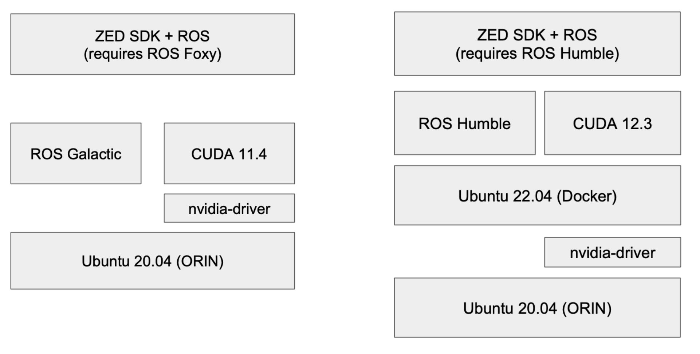

# Camera: ZED X Mini

TODO(許)

ZED SDK is bounded to jetpack: version 5.1.2 (ubuntu 20.04)

As of Jan 11, 2024, there is currently no ZED SDK suitable for jetpack
6.

<table>
<colgroup>
<col style="width: 100%" />
</colgroup>
<tbody>
<tr class="odd">
<td><p>Failed to install
SDK in ubuntu 22.04 manually and compile ros2 package:</p>
<ul>
<li><p>./ZED_SDK_Tegra_L4T35.4_v4.0.8.zstd.run -- silent skip_cuda<br />
(Jetson Xavier, Orin AGX/NX/Nano, CUDA 11.4)</p></li>
<li><p><a
href="https://github.com/stereolabs/zed-ros2-wrapper">ZED ROS 2 wrapper</a> depends on CUDA</p></li>
<li><p>CUDA version : </p>
<ul>
<li><p>11.4 only support ubuntu 20.04</p></li>
<li><p>12.3 successfully installed but ZED SDK doesn’t support </p></li>
</ul></li>
<li><p>Architecture</p></li>
</ul>
<blockquote>
<p></p>
</blockquote></td>
</tr>
</tbody>
</table>

How to install ZED in jetpack5:

Please follow the instructions in this
[page](https://github.com/stereolabs/zed-ros2-wrapper).

Stereolabs provides a ROS2 wrapper for the ZED SDK. It is designed to
integrate ZED stereo cameras with ROS2.

To install zed-ros2-wrapper, there are some prerequisites:


Make sure to install all of them in the corresponding version.

To install the **zed_ros2_wrapper**, open a bash terminal, clone the
package from Github, and build it:

```bash
# Create your workspace if it does not exist
mkdir -p ~/ros2_ws/src/
cd ~/ros2_ws/src/
git clone --recursive https://github.com/stereolabs/zed-ros2-wrapper.git
cd ..

# install dependencies
sudo apt update
rosdep install --from-paths src --ignore-src -r -y

# build the workspace
colcon build --symlink-install \
    --cmake-args=-DCMAKE_BUILD_TYPE=Release \
    --parallel-workers $(nproc)
```

To start the ZED node, open a bash terminal and use the CLI command ros2
launch:

```bash
ros2 launch zed_wrapper zed_camera.launch.py camera_model:=<camera_model>
```

Replace `<camera_model>` with the model of the camera that you are
using: 'zed', 'zedm', 'zed2', 'zed2i', 'zedx', 'zedxm'.

You can also start a pre-configured instance of rviz2 to visualize all
the information available.

Please see this
[page](https://github.com/stereolabs/zed-ros2-examples#build-the-package)
for source installation.

First, build the package:

```bash
cd ~/ros2_ws/src/ #use your current ros2 workspace
folder
git clone https://github.com/stereolabs/zed-ros2-examples.git
cd ../
rosdep install --from-paths src --ignore-src -r -y
colcon build --symlink-install --cmake-args=-DCMAKE_BUILD_TYPE=Release
source ~/.bashrc|
```


Then, you can use following command to start the ZED ROS2 Wrapper node
and Rviz2 simultaneously.

```bash
ros2 launch zed_display_rviz2 display_zed_cam.launch.py camera_model:=<camera_model>
```

Below is the example running rviz2:


