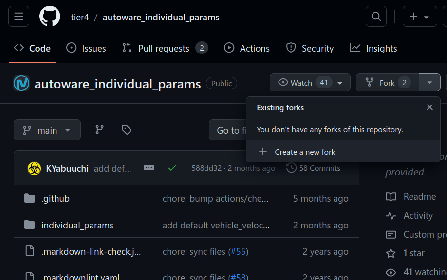
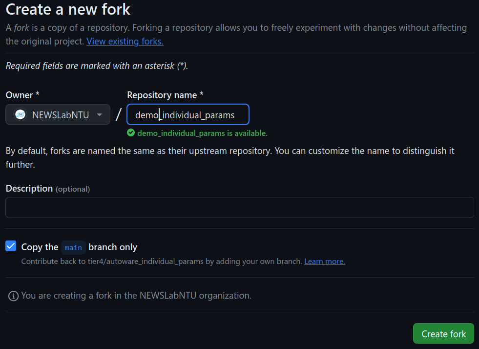
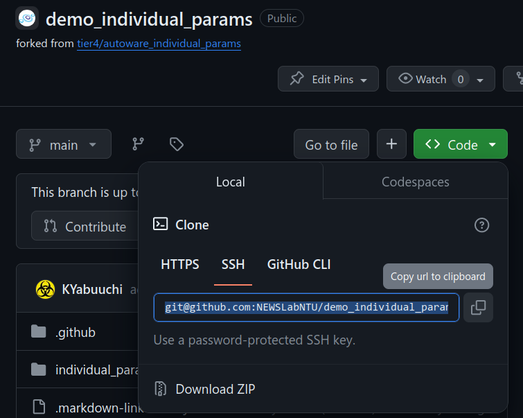

# Customization

TODO: intro

## Create a Fork for an Autoware Package

To deploy Autoware on our favorite vehicle, we'd change the sensor
parameters in the existing package to fit our needs. Here we're going
to modify the `individual_params` package, which is located in this
place in our repo.

```
./src/param/autoware_individual_params/individual_params
```

We not only tweak parameters. We want to make it simple to deploy
these changes on more vehicles. A good practice is to start our
`individual_params` fork and record changes in our fork.

First, locate the original remote repo for `individual_params`.

```bash
cd ./src/param/autoware_individual_params/individual_params
git remote show origin -n
```

and it shows

```
* remote origin
  Fetch URL: https://github.com/autowarefoundation/autoware_individual_params.git
  Push  URL: https://github.com/autowarefoundation/autoware_individual_params.git
  HEAD branch: (not queried)
  Remote branch: (status not queried)
    main
  Local ref configured for 'git push' (status not queried):
    (matching) pushes to (matching)
```


We can find the "Fetch/Push URL". Visit the URL in your favorite
browser. Let's fork the repo to our lab and the new fork
`demo_individual_params`.




After the forking is complete, remember the URL for our repo.



Come back to our my-project repository. The `individual_params`
 submodule currently points to the original version of
 `individual_params`. Let edit `.gitmodules` and change the URL to our
 fork repo.

```diff
[submodule "src/param/autoware_individual_params"]
	path = src/param/autoware_individual_params
- 	url = https://github.com/autowarefoundation/autoware_individual_params.git
+ 	url = git@github.com:NEWSLabNTU/demo_individual_params.git
```

Then, synchronize the remote URLs on affected submodules.

```bash
git submodule sync --recursive
```

Finally, commit our changes.

```bash
git add .gitmodules
git commit -m 'Change individual_param package to NEWSLAB fork'
git push
```

## Track Changes Using Git Submodule

TODO

```
my-project
├── Makefile
├── src
│   ├── autoware
│   │   ├── core
│   │   ├── launcher
│   │   ├── param
│   │   ├── sensor_component
│   │   ├── sensor_kit
│   │   ├── src
│   │   ├── universe
│   │   └── vehicle
│   ├── my_sensor
│   ├── my_motor
│   └── my_params
```
