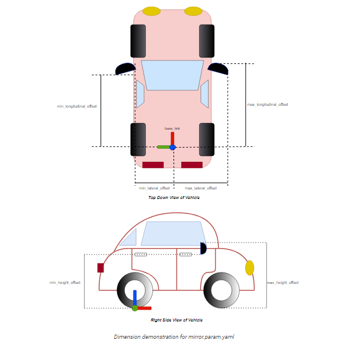

# Vehicle Configuration

(Recommendation : Understand URDF and ROS2 roughly before next step)

There are two part to describe vehicle, one is car’s parameters(fig) and
another one is relative position of the sensor regrading to car.

`sample_vehicle_description` contains the file related to parameters
of car

1.  config : parameter of car
2.  mesh : appearance of car (could be ignored)
3.  urdf : size of car

There are three  folders related to sensors.

- `sample_sensor_kit_launch` for launching sensors
  - launch: used for launch sensors' drivers. If you use lidar, you need
    to write your point cloud frames into
    `pointcloud_preprocessor.launch.py`
- `sample_sensor_kit_description`
  - `xacro`: used for describing relative position of sensor_kit_base_link
  - `sensor_kit.xacro`: used for sensors’ position
- `sample_individual_params`
  - `config/default`: used for sensors’ direction

For tutorials of modifying these files, please refer to [Autoware Documentation - Creating vehicle and sensor models](https://autowarefoundation.github.io/autoware-documentation/main/how-to-guides/integrating-autoware/creating-vehicle-and-sensor-model/).